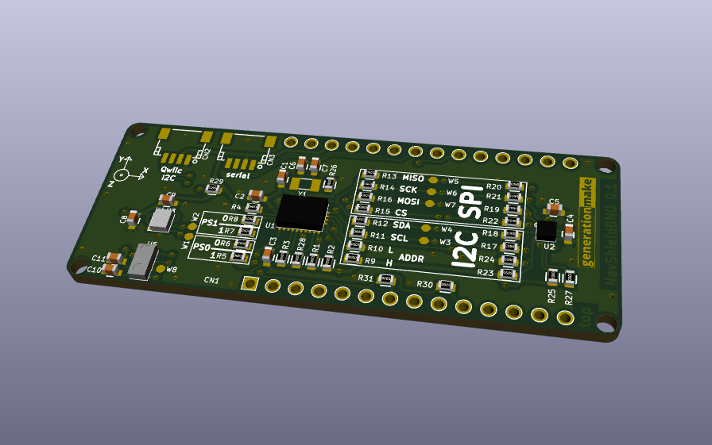

# NavShieldBNO
Navigation shield for Arduino with Bosch BNO055, BNO080 or BNO085

## PCB

### Top

### Bottom

## Resources

### Datasheets

 * *BNO080* https://cdn.sparkfun.com/assets/2/b/9/0/6/DS-14686-BNO080.pdf
 * *BMP388* https://www.bosch-sensortec.com/media/boschsensortec/downloads/datasheets/bst-bmp388-ds001.pdf
 
 ### Arduino Libraries

* [107-Arduino-BNO085](https://github.com/107-systems/107-Arduino-BNO085)
* [107-Arduino-BMP388](https://github.com/107-systems/107-Arduino-BMP388)
