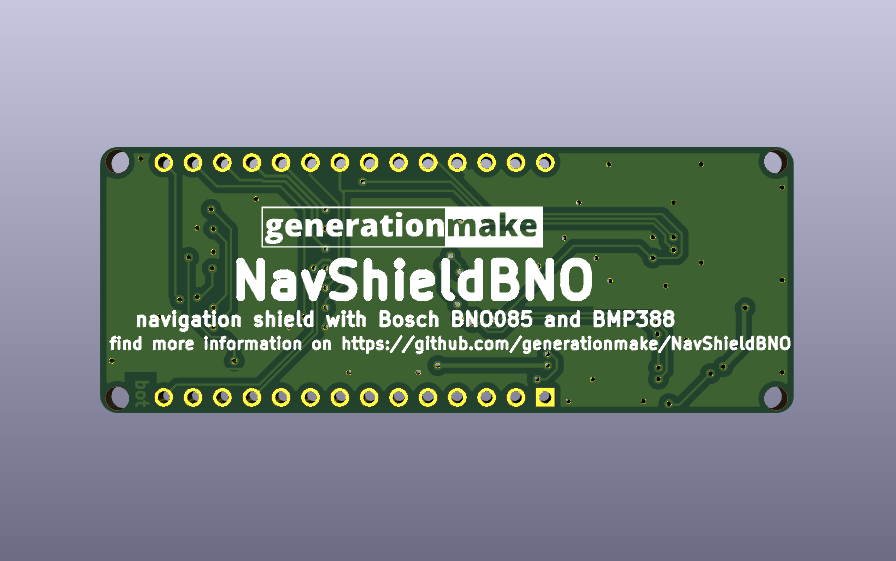

# NavShieldBNO
Navigation shield for Arduino with Bosch BNO055, BNO080 or BNO085

## PCB

### Top

### Bottom

## Variants

It is possible to mount a BNO055 instead of the BNO085. The BNO055 only supports the I2C interface.

### BOM changes

The following parts need to be changed:

| part | BNO085 variant | BNO055 variant |
|:----:|:--------------:|:--------------:|
| R1   | 10k            | DNI            |
| R2   | 10k            | DNI            |
| R5   | 10k            | DNI            |
| R6   | DNI            | 10k            |
| R7   | 10k            | DNI            |
| R8   | DNI            | 10k            |
| R10  | DNI            | 0R             |
| R11  | DNI            | 0R             |
| R12  | DNI            | 0R             |
| R13  | 0R             | DNI            |
| R14  | 0R             | DNI            |
| R15  | 0R             | DNI            |
| R16  | 0R             | DNI            |
| C8   | 100nF          | DNI            |
| C9   | 100nF          | DNI            |
| C10  | 100nF          | DNI            |
| C11  | 100nF          | DNI            |
| U1   | BNO085         | BMP055         |
| U3   | BMP280         | DNI            |
| U4   | BME280         | DNI            |
| U5   | VCNL4040       | DNI            |

## Resources

### Datasheets

 * *BNO080* https://cdn.sparkfun.com/assets/2/b/9/0/6/DS-14686-BNO080.pdf
 * *BMP388* https://www.bosch-sensortec.com/media/boschsensortec/downloads/datasheets/bst-bmp388-ds001.pdf
 * *BNO055* https://www.bosch-sensortec.com/media/boschsensortec/downloads/datasheets/bst-bno055-ds000.pdf

### Arduino Libraries

* [107-Arduino-BNO085](https://github.com/107-systems/107-Arduino-BNO085)
* [107-Arduino-BMP388](https://github.com/107-systems/107-Arduino-BMP388)
